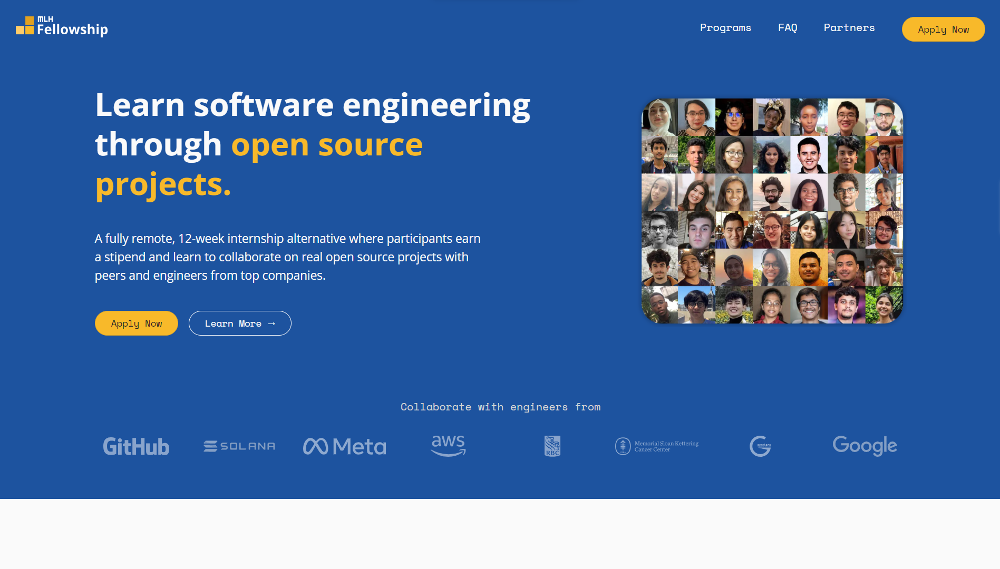

# **MLH Open Source Fellowship**

## Description
`The MLH Fellowship` offers a 12-week internship alternative for aspiring software engineers, providing hands-on experience in small group collaboration on real projects with partners remotely. This year, students receive enhanced orientation and training support. 

There are `three` fellowship tracks :

- **Software Engineering** : Software engineering is a highly sought-after skill in the tech industry. MLH Fellows in the Software Engineering Track are paired with partner projects, gaining hands-on experience within real software teams on critical projects.

- **Site Reliability Engineering** : Site Reliability Engineering, often termed DevOps, is a coveted skill in tech recruitment. Bridging software and systems engineering, it optimizes product and infrastructure for reliability and scalability. MLH Fellowship's Site Reliability Engineering Track imparts coding, debugging, and problem-solving expertise, preparing you for a successful career in SRE.

- **Web3 Engineering** : "Web3, utilizing decentralized blockchains, extends beyond cryptocurrencies to areas like gaming, social platforms, and more. The MLH Fellowship's Web3 track equips you with skills to thrive in this dynamic web sector, including blockchain coding, teamwork, and troubleshooting, preparing you for a career in Web3 and beyond."

## Eligibility
The application process starts with an eligibility undertaking. All the checkboxes must be filled to move to the next phase of applying in the fellowiship. 

- [x] **Age**: I am over the age of 18.
- [x] **Residency**: I do not reside in a country embargoed by the United States.
- [x] **Time Commitment**: I am able to commit at least 20 hours per week to the program.
- [x] **Communication**: I am proficient with English, both written and spoken.
- [x] **Coding Experience**: I can code proficiently in at least one programming language.
- [x] **Environment**: I have regular access to quiet workspace for meetings & coding.
- [x] **A/V Setup**: I have regular access to a video call quality Internet connection, webcam, & microphone.

**Application Details:**
- **Application Link:** [Insert Application Link]
- **Application Deadline:** [Insert Application Deadline, including date and time if applicable]

**Program Duration:**
[Specify the duration of the internship program, including start and end dates.]

**Stipend:**
[Indicate whether the program offers a stipend or any other form of compensation.]

**Mentorship and Support:**
[Explain the mentorship and support structure for interns, including how they will receive guidance and assistance.]

**Project Examples:**
[Provide a few examples of projects that previous interns have worked on to give applicants an idea of the type of work involved.]

**How to Apply:**
[Outline the steps for applicants to follow when applying, including any specific documents or information required.]

**Contact Information:**
[Provide contact details for inquiries or additional information about the program.]

**Resources:**
[Include links to relevant resources, such as the organization's website, documentation, or GitHub repository.]

## About the Organization

**Organization Name:** [Insert Organization Name]

**Organization Description:**
[Provide background information about the organization, its mission, and its involvement in the open-source community.]

**Previous Internship Success Stories:**
[Share success stories or testimonials from previous interns who have benefited from the program.]

**Social Media Links:**
- [Organization's Twitter](https://twitter.com/organization)
- [Organization's GitHub](https://github.com/organization)

## Additional Notes

[Include any additional information or notes about the program that may be relevant to applicants.]

Feel free to customize this template by filling in the specific details for the open-source internship program you are documenting. This template provides a structured format to present essential information to potential applicants.
